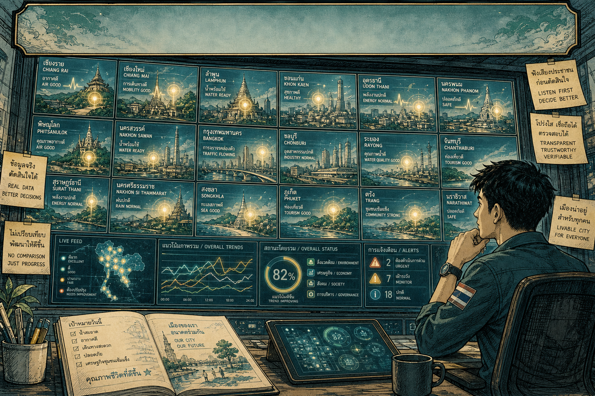

# Smart City Thailand Monitor

[](docs/hero-banner.png)

*Illustration, not telemetry.* The city tiles, gauges, and HUD in this banner are a civic-studio drawing — a picture of intent. They are **not** live readings from this repository. The running app is a bilingual operations dashboard with a live map, source adapters, and a dense sidebar. It does not render that 18-city tile wall.

Public prototype: [Nonarkara/smart-city-thailand-monitor](https://github.com/Nonarkara/smart-city-thailand-monitor).  
Live surfaces (when deployed): frontend on Cloudflare Pages (`bangkok-ioc.pages.dev`); API on Render (`smart-city-monitor-api.onrender.com`).

This operational monitor is a different project from [smart-city-thailand-index](https://github.com/Nonarkara/smart-city-thailand-index), which ranks Thai cities on SLIC methodology.

---

## What this is

An independent, open-source **civic operations monitor** for Thai cities — built as a 72-inch wall display and a public web dashboard. It pulls public feeds (traffic, flood, air, weather, citizen reports, news, satellite, markets) into one dark, information-dense screen.

It is a **studio prototype and research instrument**, not a product brochure and not a municipal system of record.

| Layer | Stack |
| --- | --- |
| Public dashboard | React 18, Vite 5, Leaflet, TanStack Query (`apps/web`) |
| Sync API | Fastify 5, TypeScript (`apps/api`) |
| Shared contracts | Types, seed data, map layers (`packages/shared`) |
| Optional worker | Admin sync trigger for cron-style deploys (`apps/worker`) |
| State | In-memory working set; snapshot to `tmp/api-state.json`; optional Postgres via `DATABASE_URL` |

The UI is bilingual (`th` / `en`). Cities in the running seed include Bangkok, Nonthaburi, Chiang Mai, Khon Kaen, and Phuket. Bangkok has the deepest live layers (Traffy Fondue, BMA flood and GIS, iTIC traffic, Overpass roads and waterways).

---

## Philosophy

Civic studio, not SaaS. The desk in the banner is the point: paper, pencils, a notebook that says *our city, our future* — then screens that earn their keep.

**Listen first, decide better.** The monitor is for seeing, not ranking. Progress is local. There is no league table here.

**Real data, better decisions.** Every number on the live screen should come from a named adapter or an honest seed fallback. No decorative KPIs. No invented telemetry.

**Transparent, trustworthy, verifiable.** Source health is first-class. Stale stays stale. Empty upstream responses are not cached as truth.

**Livable city for everyone.** The design language is an operations room: dark field `rgb(10, 14, 20)`, text `rgb(232, 237, 243)`, meaning-colored accents (red / amber / green / cyan). No rounded corners, no glassmorphism, no default marketing blue. Density over decoration.

This repo is the operational cousin of a broader civic practice. Comparison belongs in [smart-city-thailand-index](https://github.com/Nonarkara/smart-city-thailand-index). This monitor watches the street.

---

## Ethical use

**This is not an official government monitor.** It is not operated by BMA, depa, the Smart City Thailand Office, or any ministry. It is not a 72-inch stand-in for an Integrated Operations Center unless a public body independently adopts and operates a fork.

Use it as:

- a public-interest prototype and teaching instrument
- a wall display for civic studios, classrooms, and research labs
- a starting point for a city or civil-society fork you operate yourself

Do not use it as:

- an official alert channel, legal notice, or emergency dispatch system
- a substitute for Traffy Fondue, TMD, Air4Thai, or other authority feeds
- a ranking of Thai cities (that is the [index repo](https://github.com/Nonarkara/smart-city-thailand-index))
- a claim that illustrated tiles or HUD gauges are live national telemetry

Upstream licenses and terms still apply. Cite sources. Do not scrape past published limits. Do not commit secrets. Rotate any token that has ever been pasted into chat or a ticket.

---

## How it works

```
Public feeds ──► adapters (apps/api/src/adapters/) ──► in-memory store
                                                              │
                    Fastify routes (/api/overview, /api/news, …)
                                                              │
apps/web ── TanStack Query (poll ~180s) ──► sidebar + Leaflet map
        └── if API is down: seed data from packages/shared
```

**Adapters** normalize CKAN portals, RSS, REST, GeoJSON, and STAC-style catalogs into one `AdapterSyncResult` (news, projects, map features, media, and snapshot patches such as flood, traffic, Traffy Fondue).

**Sync.** When `ALLOW_LIVE_FETCH` and `AUTO_SYNC_ENABLED` are on, the API schedules a faster ops loop (default 60s) and a fuller loop (default 180s) for news, catalogs, satellite digest, markets, and CKAN. `apps/worker` can POST the admin sync route if you move refresh off the API process.

**Map.** Leaflet tiles (Mapbox / ESRI / CartoDB and similar), Overpass highways and waterways for Bangkok, BMA GIS layers, iTIC events, public CCTV points, projects, and resilience overlays. Layer IDs live in `packages/shared` and are toggled from `apps/web`.

**Fallback.** The dashboard is built to keep showing a complete screen if the API or an upstream is silent. Seed data is labeled by source health, not dressed up as live.

**Optional credentials** (names only; set them in your own environment, never in git):

| Name | Role |
| --- | --- |
| `ADMIN_TOKEN` | Protects admin sync and editorial routes |
| `NEWS_API_KEY` | Optional NewsAPI adapter |
| `COPERNICUS_CLIENT_ID` / `COPERNICUS_CLIENT_SECRET` | Sentinel Hub / Copernicus previews |
| `GEMINI_API_KEY` | Optional knowledge assistant |
| `DATABASE_URL` | Optional durable snapshots |
| `YOUTUBE_API_KEY` | Optional YouTube signals |
| `OPENAQ_API_KEY` | Optional OpenAQ |
| `VITE_API_BASE_URL` | Frontend API origin (empty locally; proxied to the API) |

Copy [`.env.example`](.env.example). Leave unused keys blank. Do not invent or publish values.

Without Copernicus credentials, satellite JSON routes report `not-configured` and image routes return a placeholder so the UI still paints.

---

## How to run / fork

**Requires Node 20+.**

```bash
git clone https://github.com/Nonarkara/smart-city-thailand-monitor.git
cd smart-city-thailand-monitor
npm install
cp .env.example .env          # then set tokens locally; never commit .env
npm run dev:api               # Fastify, default http://127.0.0.1:4000
npm run dev:web               # Vite, default http://127.0.0.1:5173
```

Build the monorepo (shared package first, as CI does):

```bash
npm run build
```

Or workspace-by-workspace:

```bash
npm run build -w packages/shared
npm run build -w apps/api
npm run build -w apps/web
```

Optional worker (only if you have set `ADMIN_TOKEN` in the environment):

```bash
npm run dev:worker
```

**Fork checklist**

1. Clone or fork this repo. Keep the MIT notice.
2. Point `VITE_API_BASE_URL` at *your* API. Do not reuse someone else's admin token.
3. Deploy static `apps/web/dist` (Cloudflare Pages reads `netlify.toml`) and the API (Render Blueprint: `render.yaml`).
4. Set secrets only in the host's environment panel. `ADMIN_TOKEN` is required for admin routes; everything else is optional.
5. Confirm `/health`, `/api/sources`, and the public dashboard before calling a deploy "live."
6. If you later run sync from cron, turn `AUTO_SYNC_ENABLED` off so you do not double-fetch.

This is a wall-first civic tool. If you fork it for another city, keep the ethic: named sources, visible staleness, no fake gauges.

---

## License

Released under the [MIT License](LICENSE). Copyright (c) 2026 Non Arkaraprasertkul.
