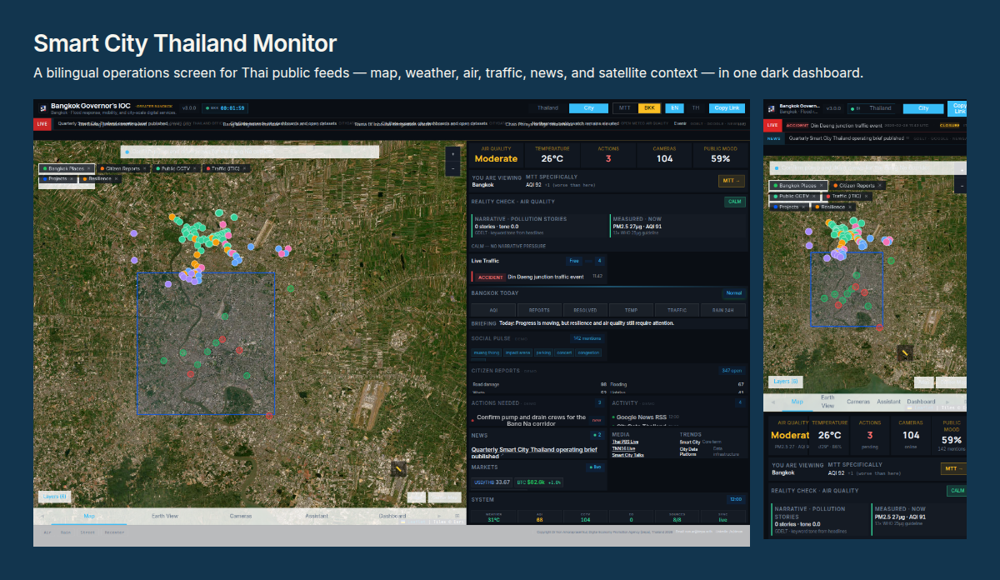
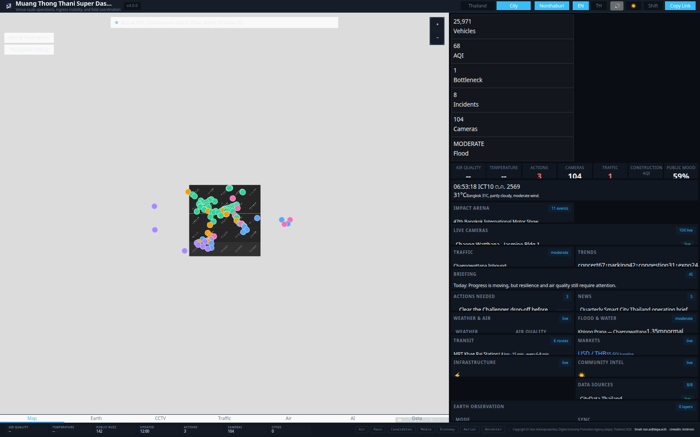
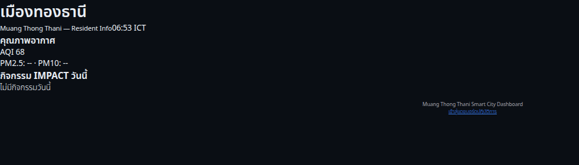
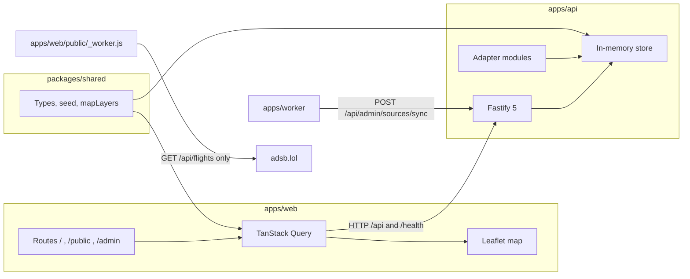
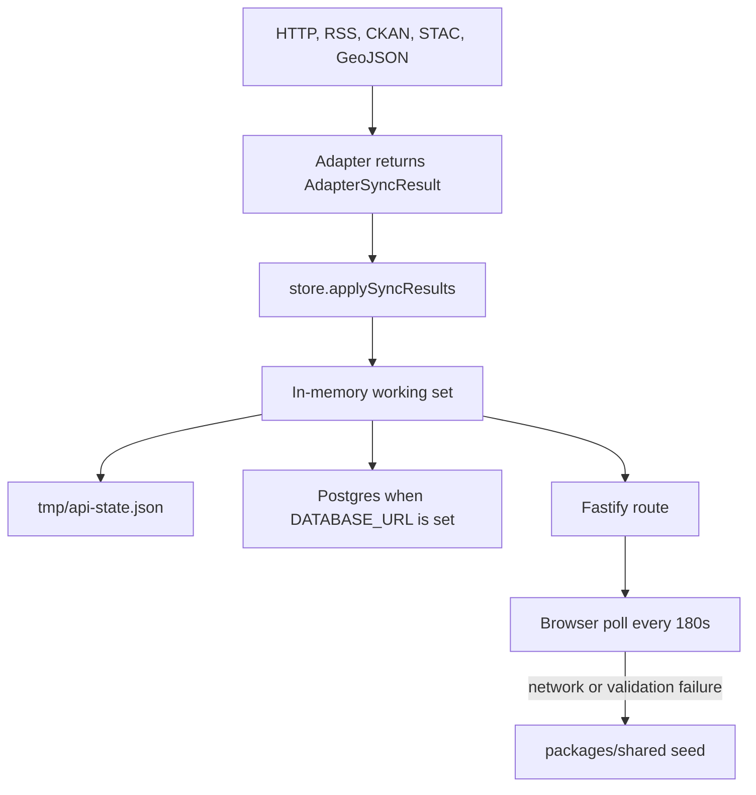

# Smart City Thailand Monitor



A bilingual operations screen for Thai public feeds — map, weather, air, traffic, news, and satellite context — in one dark dashboard.

[](https://github.com/Nonarkara/smart-city-thailand-monitor/actions/workflows/deploy-pages.yml)
[](package.json)
[](LICENSE)

The screens above are the public dashboard at [bangkok-ioc.pages.dev](https://bangkok-ioc.pages.dev/), captured on 10 October 2026 at desktop width and phone width. The field behind them is a flat Palette blue, `#12354e`. See [CREDITS.md](CREDITS.md). The API host named below was still suspended, so the picture is that frontend as served.

**Live pages:** [bangkok-ioc.pages.dev](https://bangkok-ioc.pages.dev/) and [GitHub Pages](https://nonarkara.github.io/smart-city-thailand-monitor/) both returned HTTP 200 on 9 October 2026. The hero uses a capture of the Bangkok Pages URL from 10 October 2026. The checked-in `apps/web/index.html` title is "Muang Thong Thani Super Dashboard". The API host named in `netlify.toml` and `render.yaml`, `https://smart-city-monitor-api.onrender.com`, was still returning a suspension page on 10 October 2026, so those frontends cannot be treated as a live data feed until that service is restored.

This monitor is not [smart-city-thailand-index](https://github.com/Nonarkara/smart-city-thailand-index). The index ranks cities. This repo watches feeds.

## Contents

- [What it does](#what-it-does)
- [Who it is for](#who-it-is-for)
- [Screenshots](#screenshots)
- [Architecture](#architecture)
- [Data flow](#data-flow)
- [Tech stack](#tech-stack)
- [Quickstart](#quickstart)
- [Configuration](#configuration)
- [Data sources](#data-sources)
- [Deploy](#deploy)
- [How it works](#how-it-works)
- [Fork it](#fork-it)
- [Roadmap](#roadmap)
- [FAQ](#faq)
- [Known issues](#known-issues)

## What it does

The web app is a single dark screen: a Leaflet map, layer toggles, and a dense sidebar. Copy is in Thai and English. Three routes are registered in `apps/web/src/App.tsx`:

| Path | Page |
| --- | --- |
| `/` | Operations dashboard |
| `/public` | Shorter public view |
| `/admin` | Editorial console. Writes go to the API with an `x-admin-token` header |

Seed profiles in `packages/shared/src/mockData.ts` cover Nonthaburi, Bangkok, Phuket, Khon Kaen, and Chiang Mai, plus district records. The map in `apps/web/src/InteractiveMap.tsx` also has centers for Chon Buri, Hat Yai, Phrae, Lampang, Nakhon Ratchasima, and Muang Thong Thani. Muang Thong Thani is the default city slug in code (`VITE_DEFAULT_CITY` falls back to `muang-thong-thani`) but it is not one of the five `cities` profiles.

If a request fails, the dashboard keeps the seed value shipped in `packages/shared`. That fallback is intentional. It is not a claim that the seed is live.

## Who it is for

People who want to read the code, run it, or fork it: civic studios, classrooms, and city teams building their own desk.

It is not an official system of the Bangkok Metropolitan Administration, depa, the Smart City Thailand Office, or any ministry. It is not an emergency dispatch channel, a legal notice, or a substitute for Traffy Fondue, the Thai Meteorological Department, or Air4Thai. Domain scores in the seed file are seed numbers, not a published ranking.

## Screenshots

Local Vite dev server on 9 October 2026. No API process was running, so these are the in-browser fallbacks.





## Architecture


```mermaid
flowchart LR
  subgraph webApp [apps/web]
    routes["Routes / , /public , /admin"]
    query[TanStack Query]
    map[Leaflet map]
  end
  subgraph apiApp [apps/api]
    fastify[Fastify 5]
    store[In-memory store]
    adapters[Adapter modules]
  end
  subgraph sharedPkg [packages/shared]
    contracts[Types, seed, mapLayers]
  end
  worker[apps/worker]
  pagesWorker["apps/web/public/_worker.js"]

  routes --> query --> map
  query -->|HTTP /api and /health| fastify
  fastify --> store
  adapters --> store
  contracts --> store
  contracts --> query
  worker -->|POST /api/admin/sources/sync| fastify
  pagesWorker -->|GET /api/flights only| adsb[adsb.lol]
```

`apps/web/public/_worker.js` is copied into the web build. On Cloudflare Pages it proxies `/api/flights` to adsb.lol and leaves every other path to static files. It is not the Fastify API. A comment in `apps/web/src/realtime.ts` points at `apps/web/functions/api/flights.ts`, and that functions file is not in the tree.

## Data flow


```mermaid
flowchart TD
  upstream[HTTP, RSS, CKAN, STAC, GeoJSON]
  adapter[Adapter returns AdapterSyncResult]
  apply[store.applySyncResults]
  memory[In-memory working set]
  fileSnap["tmp/api-state.json"]
  pg[Postgres when DATABASE_URL is set]
  route[Fastify route]
  poll[Browser poll every 180s]
  seed[packages/shared seed]

  upstream --> adapter --> apply --> memory
  memory --> fileSnap
  memory --> pg
  memory --> route --> poll
  poll -->|network or validation failure| seed
```

`AdapterSyncResult` can carry news, projects, map features, media feeds, and patches for resilience, social listening, markets, Traffy Fondue, flood status, and traffic. Status is `live`, `delayed`, `stale`, or `manual`.

`fetchJsonOrNull` returns nothing when `ALLOW_LIVE_FETCH` is `false` or the URL is empty. Empty upstream bodies should not be treated as a successful cache. The Overpass helper keeps a 24-hour memory cache only after it has features.

## Tech stack

npm workspaces (`package.json`):

| Package | Path | Role |
| --- | --- | --- |
| `smart-city-monitor-web` | `apps/web` | React 18, Vite 5, Leaflet, TanStack Query, React Router 6 |
| `smart-city-monitor-api` | `apps/api` | Fastify 5, TypeScript, optional `pg` |
| `smart-city-monitor-worker` | `apps/worker` | One-shot admin sync trigger |
| `@smart-city/shared` | `packages/shared` | Types, seed data, `mapLayers` |

Node `>=20`. There is no database requirement. State lives in memory. The API also writes `tmp/api-state.json` (override with `STATE_SNAPSHOT_PATH`). If `DATABASE_URL` is set, `apps/api/src/data/durableStore.ts` creates a `dashboard_snapshots` table and uses it first.

The default stylesheet tokens in `apps/web/src/styles.css` are a dark field `#0a0e14`, text `#e8edf3`, and `--radius: 0px`. An optional `[data-theme="editorial"]` block is a light theme with `--radius: 4px`. `index.html` loads Inter, Manrope, and Noto Sans Thai.

## Quickstart

```bash
git clone https://github.com/Nonarkara/smart-city-thailand-monitor.git
cd smart-city-thailand-monitor
npm ci
cp .env.example .env
npm run dev:api
npm run dev:web
```

- Web: `http://127.0.0.1:5173`
- API: `http://127.0.0.1:4000` when the API typecheck is fixed and the process stays up. See [Known issues](#known-issues).
- Vite proxies `/api` and `/health` to `VITE_API_PROXY_TARGET`, or to `VITE_API_BASE_URL`, or to `http://127.0.0.1:4000`.

`npm run dev:api` and `npm run dev:web` build `packages/shared` first. The web app can still paint from seed data when the API is down.

Root scripts:

```bash
npm run build      # shared, then api, then worker, then web
npm run typecheck  # shared emit, then noEmit on shared, api, worker, web
npm run dev:worker # POST the admin sync route; requires ADMIN_TOKEN
```

Workspace builds:

```bash
npm run build -w packages/shared
npm run build -w apps/web
npm run build -w apps/worker
npm run build -w apps/api
```

On 9 October 2026, shared, worker, and web builds succeeded in this tree. `apps/api` did not. Details are under [Known issues](#known-issues).

## Configuration

Names only. Values belong in `.env` or the host's secret store, never in git. `.env.example` comments out optional overrides on purpose: config reads `process.env.NAME ?? default`, so a copied empty `NAME=` would replace the default with an empty string.

| Name | Used by |
| --- | --- |
| `HOST` | API bind address |
| `PORT` | API port |
| `ADMIN_TOKEN` | Admin routes and `apps/worker`. Code falls back to `change-me` if unset |
| `ALLOW_LIVE_FETCH` | Master switch. Live calls run unless this is the string `false` |
| `AUTO_SYNC_ENABLED` | In-process timers. On unless set to `false` |
| `SYNC_INTERVAL_MS` | Full loop interval |
| `OPS_SYNC_INTERVAL_MS` | Ops loop interval. The ops function it calls is missing; see known issues |
| `STATE_SNAPSHOT_PATH` | JSON snapshot path |
| `DATABASE_URL` | Optional Postgres snapshots |
| `CCTV_SNAPSHOT_PATH` | Public CCTV snapshot |
| `CCTV_CACHE_TTL_MS` | CCTV cache lifetime |
| `CCTV_PROBE_TIMEOUT_MS` | CCTV probe timeout |
| `CCTV_PROBE_CONCURRENCY` | CCTV probe parallelism |
| `API_BASE_URL` | Worker target origin |
| `VITE_API_BASE_URL` | Browser API origin. Empty uses the Vite proxy |
| `VITE_API_PROXY_TARGET` | Dev-server proxy target |
| `VITE_SITE_TITLE` | Document title override |
| `VITE_DEFAULT_CITY` | Initial city slug |
| `VITE_DEFAULT_VIEW` | `city` or `national` |
| `VITE_DEFAULT_BASEMAP` | Initial basemap |
| `BASE_PATH` | Vite base, used with GitHub Pages |
| `GITHUB_PAGES` | Set by the Pages workflow |
| `NEWS_API_KEY` | NewsAPI adapter |
| `NEWS_API_QUERIES` | Pipe-separated NewsAPI queries |
| `NEWS_API_PAGE_SIZE` | NewsAPI page size |
| `GOOGLE_NEWS_RSS_QUERIES` | Pipe-separated Google News queries |
| `GOOGLE_ALERTS_FEEDS` | Pipe-separated RSS URLs |
| `GDELT_DOC_ENDPOINT` | GDELT DOC URL |
| `TALKWALKER_ALERT_FEEDS` | Pipe-separated Talkwalker RSS URLs |
| `YOUTUBE_API_KEY` | YouTube Data API |
| `YOUTUBE_CHANNEL_IDS` | Pipe-separated channel ids |
| `EONET_ENDPOINT` | NASA EONET URL |
| `CITYDATA_CATALOG_ENDPOINT` | CityData CKAN search |
| `DATAGOTH_ENDPOINT` | data.go.th |
| `URBANIS_ENDPOINT` | The Urbanis |
| `GISTDA_ENDPOINT` | GISTDA disaster API |
| `OPENAQ_ENDPOINT` | OpenAQ locations URL |
| `OPENAQ_API_KEY` | OpenAQ |
| `OPEN_METEO_WEATHER_ENDPOINT` | Open-Meteo forecast URL |
| `OPEN_METEO_AIR_ENDPOINT` | Open-Meteo air-quality URL |
| `MARKET_BTC_ENDPOINT` | CoinGecko BTC price |
| `MARKET_USD_THB_ENDPOINT` | Frankfurter USD/THB |
| `MARKET_GOLD_ENDPOINT` | Gold price URL |
| `COPERNICUS_CLIENT_ID` | Copernicus Data Space |
| `COPERNICUS_CLIENT_SECRET` | Copernicus Data Space |
| `COPERNICUS_TOKEN_URL` | Copernicus token URL |
| `SENTINEL_HUB_PROCESS_URL` | Sentinel Hub process API |
| `SENTINEL_HUB_STATS_URL` | Sentinel Hub statistical API |
| `SENTINEL_HUB_CATALOG_URL` | Sentinel Hub catalog search |
| `SATELLITE_IMAGERY_ENDPOINT` | Imagery tile template |
| `NASA_CMR_STAC_URL` | NASA CMR STAC |
| `PLANETARY_COMPUTER_STAC_URL` | Microsoft Planetary Computer STAC |
| `ESA_AGRICULTURE_COLLECTION_ENDPOINT` | ESA EO Dashboard collection JSON |
| `JAXA_WATER_COLLECTION_ENDPOINT` | JAXA GSMaP collection JSON |
| `SLIC_THAILAND_URL` | External SLIC Thailand snapshot |
| `GEMINI_API_KEY` | Knowledge assistant |
| `GEMINI_MODEL` | Assistant model name |
| `KNOWLEDGE_DIR` | Local knowledge files |
| `MAX_DAILY_AI_INQUIRIES` | Assistant daily cap |
| `TRAFFY_FONDUE_ENDPOINT` | Traffy Fondue search. Adapter is not in the sync loop |
| `WAQI_API_TOKEN` | WAQI map bounds inside the Air4Thai adapter |
| `AIR4THAI_ENDPOINT` | Air4Thai JSON |
| `TMD_RSS_ENDPOINT` | TMD regional forecast XML |
| `BMA_GIS_BASE_URL` | BMA GIS ArcGIS root |
| `BMA_FLOOD_ENDPOINT` | Optional BMA flood JSON |
| `BMA_CITYDATA_ENDPOINT` | Bangkok CKAN search |
| `TAT_TOURISM_ENDPOINT` | TAT CKAN search |
| `TCEB_ENDPOINT` | TCEB CKAN search |
| `BANGKOK_PASSAGES_MAP_URL` | Public Google My Map used as a source link |

Without Copernicus credentials, satellite JSON routes report `not-configured` and the preview route still returns a placeholder image.

## Data sources

Two different lists exist. The sync loop is what the API actually calls. The seed catalog is what `/api/sources` shows before a sync rewrites freshness.

### Called on the full loop

`runSourceSync` in `apps/api/src/services/sync.ts` waits on these 22 calls. The full loop also refreshes public CCTV in `apps/api/src/index.ts`.

| Call | Module | Upstream credited in code |
| --- | --- | --- |
| `syncCitydataCatalog` | `citydataAdapter.ts` | CityData Thailand CKAN, `catalog.citydata.in.th` |
| `syncDataGoTh` | `dataGoThAdapter.ts` | data.go.th |
| `syncUrbanis` | `urbanisAdapter.ts` | The Urbanis |
| `syncGistdaDisaster` | `gistdaDisasterAdapter.ts` | GISTDA Disaster Open API |
| `syncEsaAgriculture` | `esaAgricultureAdapter.ts` | ESA EO Dashboard catalog on GitHub |
| `syncJaxaWater` | `jaxaWaterAdapter.ts` | JAXA Earth / GSMaP collection JSON |
| `syncGoogleNewsRss` | `googleNewsRssAdapter.ts` | Google News RSS |
| `syncGdeltSignals` | `gdeltAdapter.ts` | GDELT DOC 2.0 API |
| `syncTalkwalkerAlerts` | `talkwalkerAlertsAdapter.ts` | Talkwalker Alerts RSS, only if URLs are set |
| `syncNewsApi` | `newsApiAdapter.ts` | NewsAPI, key required |
| `syncYouTubeSignals` | `youtubeSignalsAdapter.ts` | YouTube Data API or channel RSS |
| `syncMarketSignals` | `marketSignalsAdapter.ts` | CoinGecko, Frankfurter, gold-api, Yahoo chart fallback |
| `syncEonetEvents` | `eonetAdapter.ts` | NASA EONET |
| `syncOpenMeteoWeather` | `openMeteoWeatherAdapter.ts` | Open-Meteo forecast |
| `syncOpenMeteoAirQuality` | `openMeteoAirQualityAdapter.ts` | Open-Meteo air quality |
| `syncOpenAq` | `openaqAdapter.ts` | OpenAQ v3 |
| `syncTimeSnapshot` | `timeSyncService.ts` | The server clock |
| `runIticSync` | `iticAdapter.ts` | iTIC / Longdo events and cameras |
| `runBmaRoadsSync` | `bmaGisRoadsAdapter.ts` | BMA district ArcGIS |
| `runBmaCanalsSync` | `bmaGisCanalsAdapter.ts` | BMA district ArcGIS |
| `runBmaDrainageSync` | `bmaGisDrainageAdapter.ts` | BMA district ArcGIS |
| `runBangkokStatsSync` | `bangkokPublicStatsAdapter.ts` | Does not call NSO or World Bank. It returns `generateMockBangkokStats` and still marks the result `live` |

Public CCTV (`services/publicCctv.ts`) uses the Longdo camera feed named in the seed source `public-cctv`.

On-demand routes, not inside `runSourceSync`:

| Route | Code | Upstream |
| --- | --- | --- |
| `/api/layers/bangkok-highways`, `bangkok-arterials`, `bangkok-waterways` | `overpassAdapter.ts` | OpenStreetMap via Overpass |
| `/api/satellite/digest`, `stats`, `search`, `preview/:presetId`, `stac-tiles` | `services/satellite.ts` | Sentinel Hub / Copernicus when credentials exist; NASA CMR and Planetary Computer URLs are configured |
| `/api/cctv/public` | `services/publicCctv.ts` | Longdo public cameras |
| `/api/external/slic-thailand` | `services/slicThailand.ts` | `SLIC_THAILAND_URL` |
| `/api/assistant/status`, `POST /api/assistant/query` | `services/knowledgeAssistant.ts` | Gemini when `GEMINI_API_KEY` is set |
| `/api/flights` on the Pages worker only | `apps/web/public/_worker.js` | adsb.lol |

Map tiles and raster overlays are selected in `InteractiveMap.tsx`. Seed source records also name NASA GIBS, NASA FIRMS, EOX Sentinel-2 cloudless, JRC Global Surface Water, and EMODnet Bathymetry. Those records are credits and layer metadata. They are not all separate adapter calls.

### Present as modules, not called by the sync loop

These files export a sync or fetch function. `server.ts` and `sync.ts` do not import them, so a running API will not refresh them until someone wires them in:

| Module | Intended upstream |
| --- | --- |
| `traffyFondueAdapter.ts` | Traffy Fondue public API, `publicapi.traffy.in.th` |
| `bmaFloodAdapter.ts` | `BMA_FLOOD_ENDPOINT` if set, otherwise an Open-Meteo rainfall estimate. The estimate uses fixed pump counts in source |
| `air4thaiAdapter.ts` | Air4Thai and a WAQI bounds request |
| `tmdWeatherAdapter.ts` | Thai Meteorological Department regional XML |
| `bmaGisAdapter.ts` | `bmagis.bangkok.go.th` |
| `bmaCityDataAdapter.ts` | Bangkok city data portal CKAN |
| `tatTourismAdapter.ts` | Tourism Authority of Thailand CKAN |
| `tcebAdapter.ts` | TCEB open data CKAN |
| `communityIntelAdapter.ts` | Open-Meteo, OpenSky, USGS, Nager.Date, and a Thai lottery API. No `/api/community-intel` route exists. The web client falls back to an object written in `App.tsx` |

`ckanHelpers.ts` is shared by the CKAN adapters and is not itself a source.

Please keep the provider's name on anything you display, and follow that provider's terms. OpenStreetMap data is under the ODbL. News, satellite, and CKAN responses stay under their publishers.

## Deploy

The tree contains four deploy descriptions. They do not all say the same thing.

| File | What it describes |
| --- | --- |
| `netlify.toml` | Static build of `apps/web`. Title "Bangkok Governor's IOC", default city `bangkok`, API base `https://smart-city-monitor-api.onrender.com`. Cloudflare Pages can build from this file |
| `render.yaml` | Two static sites plus `smart-city-monitor-api`. Static env uses the Muang Thong Thani title and city. API health check is `/health` |
| `.github/workflows/deploy-pages.yml` | On push to `main`, build the web app with `GITHUB_PAGES=true` and `BASE_PATH=/smart-city-thailand-monitor/`, then deploy GitHub Pages |
| `fly.toml` | Fly.io app `mtt-dashboard-api`, region `sin`, health check `/health` |
| `wrangler.toml` | Cloudflare Pages project name `mtt-dashboard`, output `apps/web/dist` |

`npm run build -w apps/web` copies `apps/web/public/_worker.js` to `dist/_worker.js`.

Before calling a deploy live, open `/health` and `/api/sources` on *your* API. The Render host above was suspended when this README was written.

## How it works

A good first reading order:

1. `packages/shared/src/types.ts` — the nouns: cities, sources, news, map features, freshness.
2. `packages/shared/src/mockData.ts` — the seed the UI can show with no network, and the `mapLayers` list.
3. `apps/web/src/App.tsx` — routes, `fetchFromApi`, and `LIVE_POLL_INTERVAL_MS` (180000). `fetchFromApi` tries each API base, then returns the fallback you passed in.
4. `apps/web/vite.config.ts` — dev proxy and GitHub Pages `base`.
5. `apps/web/src/InteractiveMap.tsx` — Leaflet, city centers, layer colors.
6. `apps/api/src/config.ts` — every backend environment name and its code default.
7. `apps/api/src/server.ts` — the route table. Public GETs read the store. Admin POSTs require `requireAdmin`.
8. `apps/api/src/data/store.ts` — seed hydration and `applySyncResults`.
9. `apps/api/src/adapters/common.ts` — `AdapterSyncResult`, `fetchJsonOrNull`, `buildResult`.
10. `apps/api/src/services/sync.ts` — the 22-call full loop.
11. `apps/api/src/index.ts` — listen, then schedule ops and full timers when live fetch and auto sync are on.
12. `apps/worker/src/index.ts` — how a cron box would trigger sync without owning the adapters.

One request, end to end: the browser asks `/api/overview?view=city&city=bangkok`. Fastify calls `store.getOverview`. The store filters seed or previously synced records. Nothing in that handler reaches the public internet. Freshness changes only when a sync result has been applied, or when the browser gives up and paints the fallback it already holds.

To add a source, follow an existing adapter that already returns `buildResult`, register it inside `runSourceSync` (and the matching fallback id list), add a `sources` entry if the sidebar should name it, and add a route only if the UI needs a dedicated payload. Map layers also need a `mapLayers` entry and a color in `InteractiveMap.tsx`.

There is no test suite in this repository. `npm run typecheck` and the web build are the checks that exist.

## Fork it

1. Fork the GitHub repo. The remote this tree uses is `Nonarkara/smart-city-thailand-monitor`.
2. Read [LICENSE](LICENSE). It is an MIT grant, copyright 2026 Non Arkaraprasertkul. Keep that notice with the files it covers.
3. `npm ci`, then copy `.env.example` to `.env`.
4. Set your own `ADMIN_TOKEN`. Do not ship the code default.
5. Point `VITE_API_BASE_URL` at the API you operate. The checked-in Pages and Render files still name `smart-city-monitor-api.onrender.com`, which was suspended.
6. Leave `ALLOW_LIVE_FETCH=false` until you have read the upstream terms you are about to call.
7. Build `packages/shared`, then the app you are deploying. The API build is currently red; see below.
8. Serve `apps/web/dist` as a static site. Run `apps/api` as a Node process with `HOST=0.0.0.0`.
9. If a cron worker calls `POST /api/admin/sources/sync`, set `AUTO_SYNC_ENABLED=false` on the API so the same adapters are not started twice.
10. Check `/health`, `/api/sources`, `/`, and `/public` before you describe the fork as live.

Replace the title, the default city, and any Muang Thong or Bangkok copy that does not belong to your deployment. `netlify.toml`, `render.yaml`, the GitHub Pages workflow, and `apps/web/index.html` do not currently agree with each other.

## Roadmap

These are gaps already visible in this tree, not a promise of dates.

- Make `npm run build -w apps/api` pass. The three TypeScript errors are listed below.
- Either export `runOpsSync` or stop scheduling it. The ops timer is wired to a function that does not exist, while Traffy, flood, air, and TMD modules sit unused.
- Register those unused adapters, or delete the dead route expectations. The web app calls `/api/community-intel` and the server does not implement it.
- Stop marking `generateMockBangkokStats` as `live`, or replace it with a cited dataset.
- Add tests around `fetchFromApi` fallback and `applySyncResults`.
- Pick one default city and one document title across `index.html`, `netlify.toml`, `render.yaml`, and the Pages workflow.
- Restore or replace the suspended API host before treating the public Pages URLs as operational.

## FAQ

**Is this an official Bangkok command center?**
No. It is an independent codebase. A public agency would have to run its own fork and say so.

**Why do I see numbers with the API switched off?**
`fetchFromApi` returns the fallback argument. Much of that fallback is `packages/shared` seed data. The community-intel card uses an object literal in `App.tsx` because its route is missing.

**Which city opens first?**
Unless you set `VITE_DEFAULT_CITY`, the code uses `muang-thong-thani`. `netlify.toml` sets `bangkok` instead. The five seed profiles do not include Muang Thong Thani.

**Do I need API keys to look around?**
No. Keys unlock NewsAPI, YouTube, OpenAQ, Copernicus / Sentinel Hub, and Gemini. Google News RSS, Open-Meteo, EONET, and the seed screen do not need a key. Local `.env.example` sets `ALLOW_LIVE_FETCH=false`.

**Where is the ops sync?**
`index.ts` imports `runOpsSync` from `services/sync.ts`. That module only exports `runSourceSync`. The 60-second loop cannot run until that export exists.

**Can I cache an empty Overpass response?**
The adapter should not. It is written to avoid storing an empty feature list for 24 hours. Check `features.length` if you change it.

**Where do I report a security problem?**
[SECURITY.md](SECURITY.md). Do not open a public issue with tokens in it.

## Known issues

Checked with `npx tsc -p apps/api/tsconfig.json --noEmit` after `npm run build -w packages/shared` on 9 October 2026. Three errors:

- `apps/api/src/data/store.ts`: `bangkokFloodStatusSeed` is not exported by `@smart-city/shared`. The compiler suggests the type `BangkokFloodStatus`. The seed value is not in `mockData.ts`.
- `apps/api/src/data/store.ts`: `traffyFondueSeed` is not exported by `@smart-city/shared`.
- `apps/api/src/index.ts`: `./services/sync.js` has no exported member `runOpsSync`.

`npm run build` runs the API package before the web package, so the root build stops there. `npm run build -w packages/shared`, `npm run build -w apps/worker`, and `npm run build -w apps/web` completed successfully on that same checkout. The GitHub Pages workflow builds shared and web only.

Other gaps, same checkout:

- Traffy, flood, Air4Thai, TMD, BMA CKAN, TAT, TCEB, `syncBmaGis`, and community intel are not registered in the sync loop.
- `/api/community-intel` is requested by the client and not implemented.
- `runBangkokStatsSync` labels generated numbers `live`.
- `https://smart-city-monitor-api.onrender.com/health` returned a service-suspended page.
- `package.json` version is `3.0.0`. `apps/web/index.html` meta version is `4.0.0`.
- No automated tests.

## Contributing

Read [CONTRIBUTING.md](CONTRIBUTING.md), [CODE_OF_CONDUCT.md](CODE_OF_CONDUCT.md), and [SECURITY.md](SECURITY.md). Issue and pull request templates live under `.github/`.

## License

The [MIT License](LICENSE) in this tree covers the software as granted there. Copyright (c) 2026 Non Arkaraprasertkul. Data providers, fonts, and the Palette colour data keep their own terms. See [CREDITS.md](CREDITS.md).
